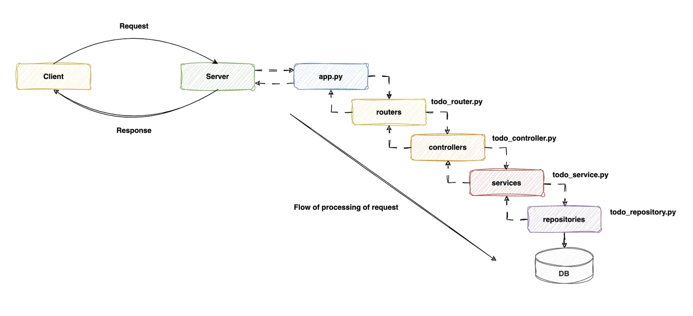

# fast_api

## Routers
- Routers in APIs organize and group related endpoints (routes) into separate modules or files, enhancing code modularity and structure.

## Controllers
- Controllers handle incoming requests, orchestrate the application’s logic, and manage the flow of data between the API routes (endpoints) and the services layer.

## Service Layer
- Services contain the core business logic of the API, implementing specific functionalities and operations required by the application. They abstract complex business rules from the API endpoints.

## Repository Layer
- Repositories provide an abstraction layer for data persistence operations, encapsulating interactions with databases or external data sources. They offer standardized methods for storing, retrieving, updating, and deleting data.